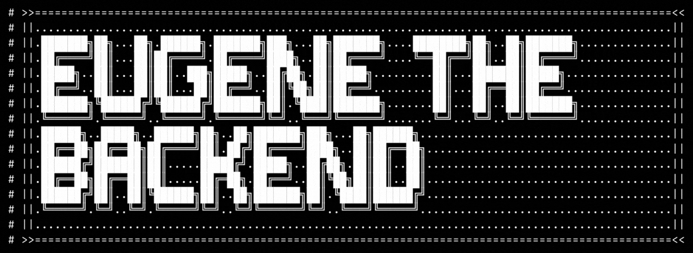
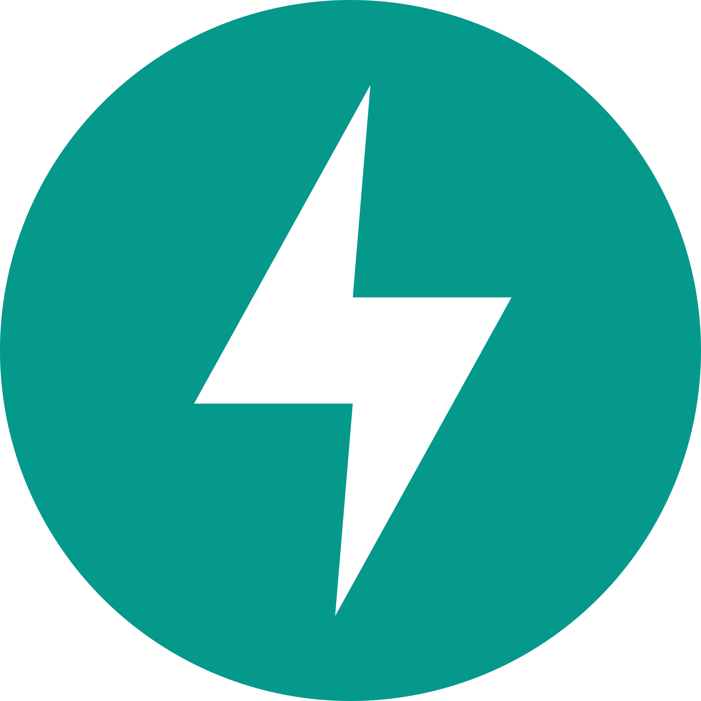
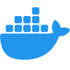
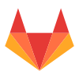

# Hi there ✨ I'm ...

## about me

TODO: write my story

## technologies

 Python  FastAPI  Django  SQLAlchemy  Pandas

 html  css  Javascript  React

 Postgres  Redis  MongoDB  SQLite

 Docker  Gitlab CI  Github CI

## contacts

<!-- TODO: maybe change to badges? Example: https://github.com/fastapi/fastapi -->

 [telegram](https://t.me/emakunev)

 [LinkedIn](https://www.linkedin.com/in/eugene-makunev-b9682b233/)

 [Mail](mailto:e.makunev@gmail.com)
